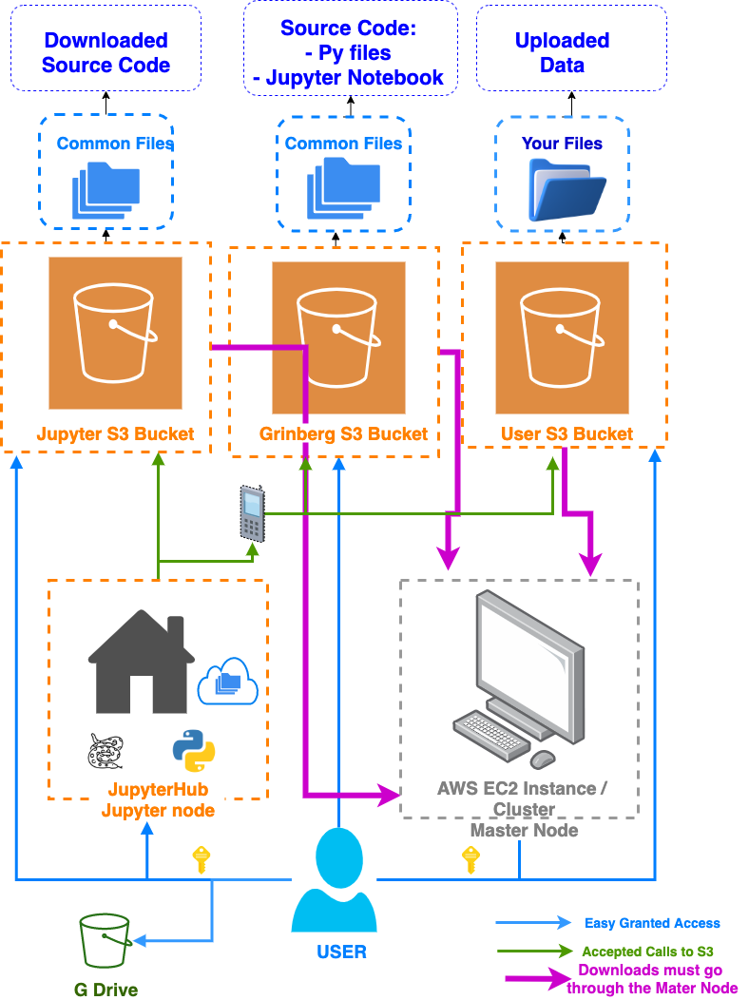

# Get Acquainted

There is some jargon we need to get used to, such as:
- S3 Buckets
- Personal S3 buckets
- Grinberg's S3 bucket
- Master node
- JupyterHub node

As well as what all of these mean. This is important, as I believe it will paint a picture as to how everything works (and for you to hopefully better understand it!)

#### Watching this video will assist you in the process (click on image): 

#### Here is an image of the pipeline I showed in the video above:

